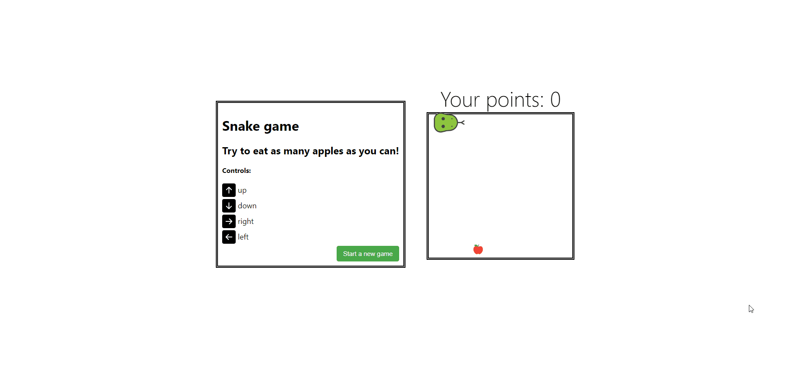
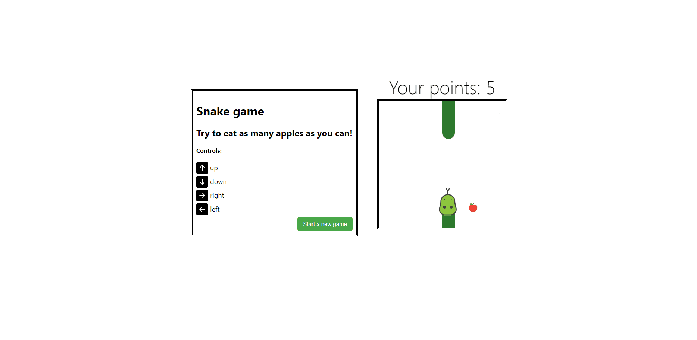

# SNAKE GAME

## SPIS TREŚCI

- [URUCHOMIENIE PROJEKTU](#uruchomienie-projektu)
- [UŻYTE TECHNOLOGIE / BIBLIOTEKI](#użyte-technologie-/-biblioteki)
- [FUNKCJONALNOŚCI](#funkcjonalności)
- [STATUS PROJEKTU](#status-projektu)
- [ZRZUTY EKRANU](#zrzuty-ekranu)

## URUCHOMIENIE PROJEKTU

W celu uruchomienia projektu należy wejść w folder z projektem oraz wpisać:

```
yarn install
```

lub

```
npm i
```

następnie należy uruchomić projekt za pomocą polecenia:

```
yarn start
```

lub

```
npm start
```

## UŻYTE TECHNOLOGIE / BLIBLOTEKI

Frontend:

- react (18.2.0)
- jest

## FUNKCJONALNOŚCI

- Możliwość gry w Sneaka
- Wąż przechodząc przez ścianę pojawia się odpowiednio po drugiej stronie
- W miarę zjadania jabłem wąż porusza się coraz szybciej oraz staje się coraz dłuższy
- Nad planszą znajduje się licznik punktów
- Możliwość wznowienia / zresetowania gry
- Poruszanie się jest dostępne za pomocą klawiatury

## STATUS PROJEKTU

Projekt zakończony: 14 sierpnia

## ZRZUTY EKRANU



